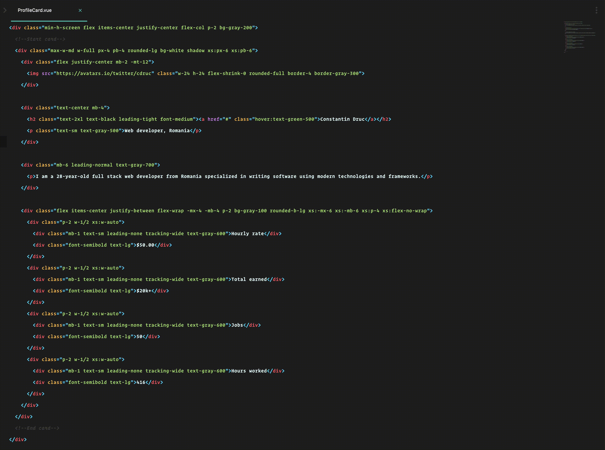

# AttrFold for SublimeText
Fold & unfold attributes making it easier to work with utility-first CSS Frameworks.

### Usage
- Open a file containing `class="super long list of classes`.
- Press key binding: 
    - `super+option+k` (macOs)
    - `ctrl+alt+k` (linux & windows)

### Installation via Package Control
1. Open the Command Palette (Tools > Command Palette...)
2. Search for and choose "Package Control: Install Package"
3. Search for "AttrFold" and install.
4. Windows users will need to restart Sublime Text to finish the installation.

### Installation (Manual)
Download the zip, re-name resulting folder to: AttrFold, then put the folder into your Sublime Text Packages folder.